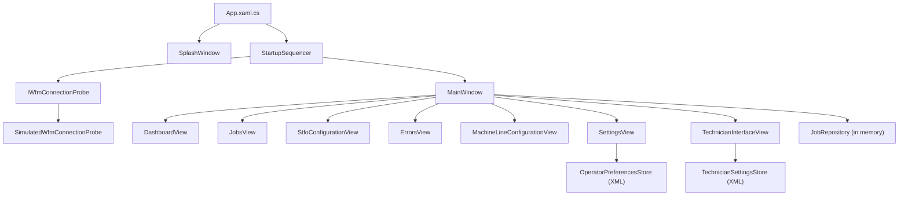
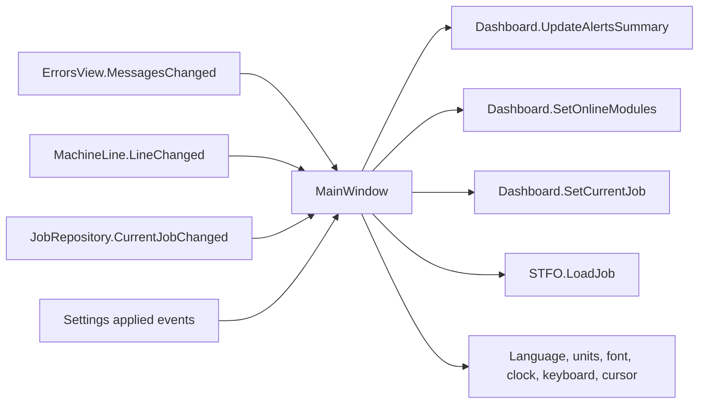

# Architecture

## Scope

CPBourg NextGen Operator Interface 1.30.0 is a Windows WPF prototype targeting
.NET Framework 4.7.2 and C# 7.3. It uses XAML views with code-behind, plain C#
models, event-based coordination, and two small XML stores. There is no
dependency-injection container, database, network client, or MVVM framework.

The architecture is intentionally small enough for client evaluation. It is
not yet the target architecture for production machine control.

## Runtime overview



`MainWindow` is the composition root after startup. It owns the shared
`JobRepository`, subscribes to child-view events, switches visible screens,
and distributes applied language, units, date/time offset, font size, keyboard
layout, and cursor preferences.

## Layer responsibilities

### Application and startup

| File | Responsibility |
|---|---|
| `App.xaml.cs` | Shows the splash, constructs the startup sequence, and opens `MainWindow` after a successful result |
| `Startup/StartupSequencer.cs` | Runs ordered asynchronous phases and reports `StartupProgress` without referencing WPF |
| `Startup/IWfmConnectionProbe.cs` | Current startup-only backend boundary |
| `Startup/SimulatedWfmConnectionProbe.cs` | Successful or deliberately failing local connection simulation |
| `Views/SplashWindow.xaml(.cs)` | Renders progress and build information |

Startup failure leaves the splash visible with an error. Retry, exit, timeout,
telemetry, and recovery policy are not implemented.

### Shell and navigation

`Views/MainWindow.xaml` contains the fixed header, global menu overlay, and one
instance of each main screen. `MainWindow.xaml.cs` collapses all content views
and then shows the selected one. Navigation is therefore state within one
window, not window replacement or URI routing.

Child views do not navigate directly. They raise intent events such as
`NavigateToJobsRequested`, `NavigateHomeRequested`, or `CloseRequested`.
`MainWindow` translates those events into shell navigation.

The STFO wizard is a special route: it is opened from the STFO machine tile,
always resets to Overview, and raises `TitleChanged` so the shell header follows
the selected step.

### Shared state and models

The `Models` directory contains WPF-independent records, settings, format
catalogs, measurement conversion, and repositories.

| Type | Lifetime and ownership |
|---|---|
| `JobRepository` | One instance owned by `MainWindow`; seeded at every launch |
| `JobRecord` | Mutable comment, log, and job-specific STFO settings; otherwise constructor-defined data |
| `StfoJobSettings` | Canonical metric configuration attached to each `JobRecord` |
| `OperatorPreferencesStore` | Reads/writes per-user settings XML under LocalAppData |
| `TechnicianSettingsStore` | Reads/writes per-user technician XML under LocalAppData |
| `BookFormatCatalog` | Static preset lookup and 0.05 mm custom-format matching |
| `MeasurementFormatter` | Canonical millimeter/inch conversion and formatting |

The job repository, production simulation, errors, and machine line are not
durable. Restarting the process recreates their sample state. Only operator and
technician settings persist.

### Views

Main view code-behind owns presentation state and interaction behavior:

| View | Primary responsibility |
|---|---|
| `DashboardView` | Counters, local production state machine, alert summary, current job, and machine tiles |
| `JobsView` | Search, selection, load/save/remove, comment, barcode lookup, and log export dialogs |
| `StfoConfigurationView` | Five-step BBM/STFO workflow, transactional edits, unit-aware inputs, and vector previews |
| `MachineLineConfigurationView` | Pending line edits, duplicate prevention, final code prompt, and confirmed-line event |
| `SettingsView` | Pending/applied preference transaction and durable save |
| `ErrorsView` | Sample error collection, counts, details, clearing, and Home navigation |
| `TechnicianInterfaceView` | Durable technician choices and prototype protected actions |
| `LocalizationManager.*` | Runtime translation catalogs and recursive application to WPF trees |

Reusable modal overlays are user controls embedded in their parent screen.
They communicate through typed events rather than returning synchronous dialog
results.

### Theme and assets

- `Theme/BrandTheme.xaml` is the primary brush, font, control-style, and size
  resource dictionary.
- `Assets/cpbourg-logo.png` is copied beside the executable by the project file.
- `LogoLoader` loads the external asset and falls back to a generated mark.
- `HighFidelity` and `LowFidelity` contain design references, not runtime state.

## Important event flows



These subscriptions are created in the `MainWindow` constructor. When adding a
new shared concern, keep one owner and publish a narrow event or service
contract; do not let sibling views reach into each other.

## Persistence paths

The stores write under:

```text
%LOCALAPPDATA%\CPBourg\NextGenGui\operator-preferences.xml
%LOCALAPPDATA%\CPBourg\NextGenGui\technician-settings.xml
```

Missing, malformed, or inaccessible files fall back to defaults. Saves create
the directory when required and report a user-visible error through the view.
There is no schema migration beyond the current `version="1"` attribute.

## Current technical constraints

- UI behavior is concentrated in code-behind; `StfoConfigurationView` and
  `DashboardView` are the highest-complexity files.
- Shared state uses events and concrete view instances rather than injected
  services.
- Startup has a WFM probe boundary, but production commands and data streams do
  not yet have equivalent interfaces.
- There is no automated test project in the repository.
- Several values are operator-facing string tokens. Renaming one requires
  checking persistence, localization, and comparison logic.

These constraints are acceptable for the prototype. Before production work,
extract protocol-independent services and state machines so they can be tested
without WPF.
