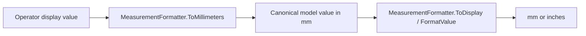

# Localization and units

## Supported settings

The prototype supports English, French, Dutch, German, Spanish, and Italian.
Measurement display supports millimeters and inches. The saved choice is loaded
before `MainWindow` finishes initialization and then distributed to all affected
views.

## Translation architecture

`LocalizationManager` is a static partial class split by vocabulary:

| File | Content |
|---|---|
| `LocalizationManager.cs` | Shell/settings catalog, language selection, lookup, and recursive WPF application |
| `LocalizationManager.Operations.cs` | Jobs, errors, technician, dashboard, and machine-line operational text |
| `LocalizationManager.Stfo.cs` | STFO navigation, fields, summaries, prompts, and feedback |

English UI text is the source key. Non-English dictionaries map that exact
source string to translated text. Missing entries deliberately fall back to the
English source.

The manager stores the original text in an attached `SourceText` property the
first time it sees a WPF element. This permits repeated language switching
without translating an already translated value. Recursive application covers
unbound `TextBlock`, `Run`, string `ContentControl.Content`, and string tooltips.

## Static and generated text

Static XAML is handled by `LocalizationManager.Apply(root)`. Generated text and
data objects need an explicit refresh because the translated strings may have
already been copied into an item source or formatted summary.

Each complex screen therefore exposes `ApplyLanguage`, which follows this
pattern:

1. recursively translate the current visual/logical tree;
2. rebuild generated item sources, column headers, status messages, and labels;
3. redraw previews containing translated text;
4. reapply localization to embedded dialogs.

`MainWindow` calls these methods when an applied language changes and again
when a screen becomes visible.

## Adding operator-facing text

1. Author the English source in XAML or code.
2. Add the exact key to the appropriate catalog for `fr`, `nl`, `de`, `es`,
   and `it`. `Operations` uses the `Op` helper when one key has all five values.
3. For formatted text, translate the format string before calling
   `string.Format`. Preserve placeholder order and count in every language.
4. Do not translate operator-authored data, job names, barcode IDs, model codes,
   file paths, or numeric values.
5. If text is generated into an `ItemsSource`, add it to the owning view's
   `ApplyLanguage` refresh.
6. Test every supported language on the affected screen and its dialogs.

Do not use a translated display label as a durable token. Settings files and
state comparisons currently use language-neutral English tokens such as
`Millimeters`, `Auto`, and `Always Reject`; changing those values requires a
migration plan.

## Culture behavior

`SetLanguage` changes `CurrentUICulture`, while most numeric model formatting is
explicitly invariant. Operator messages formatted with `TF` use the current
culture. Date/time display uses a fixed `yyyy-MM-dd HH:mm` pattern.

The keyboard-layout setting requests a Windows input culture:

- AZERTY -> `fr-FR`
- QWERTY -> `en-GB`
- QWERTZ -> `de-DE`

Windows may substitute the closest installed input language. Failure to find an
optional language pack does not invalidate the saved preference.

## Canonical measurement rule

All physical data is stored in millimeters, regardless of display preference.
This includes job width/length, STFO dimensions and offsets, booklet length,
and simulated speeds expressed as millimeters per second.

`MeasurementFormatter` defines `25.4` millimeters per inch and centralizes unit
symbols, values, lengths, dimensions, and speeds. Inputs in imperial mode must
be converted back to millimeters before updating state.

Never convert a value already converted for display and store the result back
as though it were canonical. Repeated unit changes should not introduce drift.

## Adding a measured field

1. Name the model property with an `Mm` suffix when its unit would otherwise be
   ambiguous.
2. Store and validate limits in millimeters.
3. Format through `MeasurementFormatter` using a precision suitable for the
   control.
4. Convert keypad or text input with `ToMillimeters` before assignment.
5. Refresh the field from canonical state when units change.
6. Add round-trip tests at boundaries and for repeated metric/imperial changes.

## Font, clock, and calibration

`FontSizeManager` remembers each element's authored base size and applies 0.9,
1.0, or 1.1 to text. It intentionally does not scale touch targets.

The date/time setting stores an offset from the Windows clock. The shell and
settings row display `DateTime.Now + offset`; the system clock is unchanged.

Screen calibration stores a completion flag and an average error in pixels.
It is a prototype workflow only and does not affect Windows pointer transforms.

## Localization review checklist

- no visible English remains after switching language;
- long labels wrap without clipping in windowed and maximized modes;
- generated rows, diagrams, dialogs, status text, and page titles refresh;
- changing language repeatedly returns to the correct source strings;
- numbers, paths, job names, model codes, and operator comments are preserved;
- unit symbols and values update together;
- a restart restores the applied language and unit.
