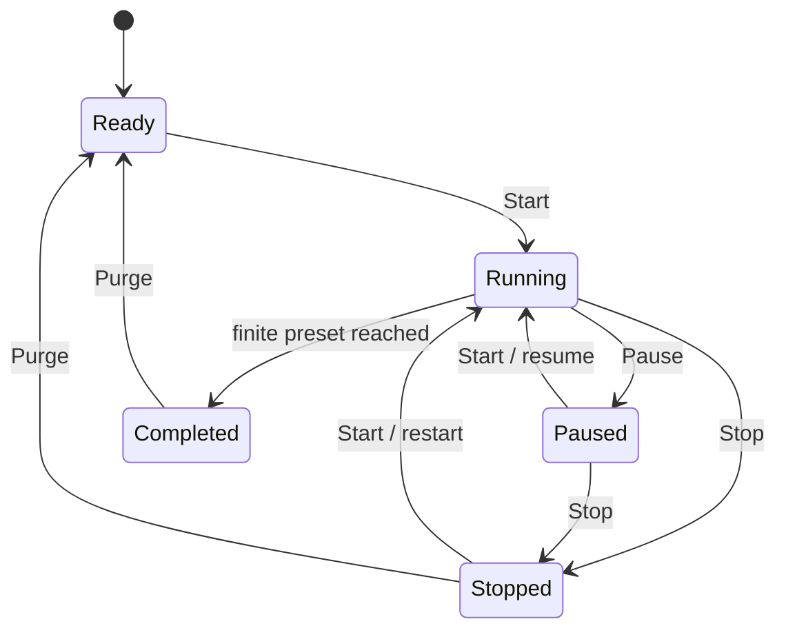
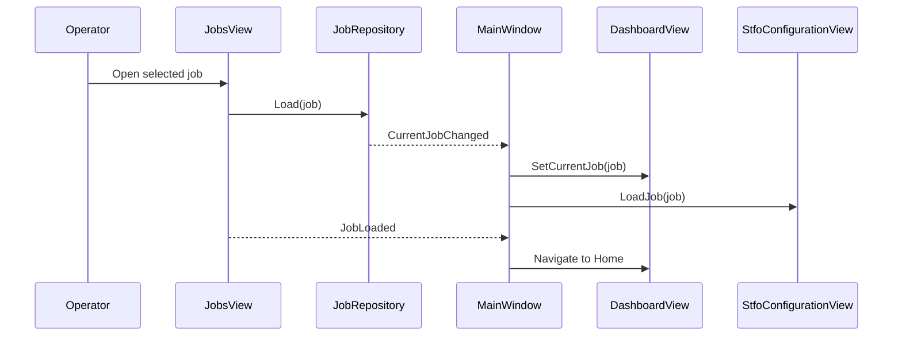

# State and workflows

This guide records behavioral invariants that are easy to break when changing
the UI. It describes version 1.30.0, not a future machine implementation.

## Production simulation

`DashboardView` owns a private production state and a one-second
`DispatcherTimer`.

Start is enabled only when:

- a current job exists;
- the active error count is zero;
- there are no pending counter edits; and
- state is Ready, Paused, or Stopped.

Pause is enabled only while Running. Stop is enabled while Running or Paused.
Purge is enabled while Stopped or Completed. Purge resets completed sets and
the preset to zero and returns the simulation to Ready.

The timer increments confirmed completed sets once per second. Preset zero is
unlimited. A positive preset transitions to Completed when the completed value
reaches it.

This is a UI simulation. None of these transitions command hardware.

## Counter transaction

The dashboard keeps two copies of each counter:

- working values shown in the editable controls; and
- confirmed values used by the production timer.

Minus, plus, direct keypad entry, Reset to Zero, and Set Target change working
values and mark the transaction pending. Confirm copies both working values to
their confirmed values. Start remains disabled while a change is pending.

While Running, all counter action buttons are disabled. The number displays
remain visually legible but are not hit-testable or focusable. Editing becomes
available again in Ready, Paused, Stopped, or Completed.

## Job lifecycle

`MainWindow` creates one `JobRepository`. The constructor seeds five jobs and
loads the first one as `CurrentJob`.

Save As New inserts the new job at index zero. Book format is resolved from
canonical dimensions; a match within 0.05 mm uses the preset name, otherwise
the format is Custom. Replacing the current job preserves current selection by
making the new record current.

Removing the current job selects the next first job. Jobs, comments, and logs
are in memory and reset at application restart.

Barcode scanning assumes a keyboard-wedge scanner. The entered ID is matched
against saved `BarcodeId` values. Job-log export uses a user-selected local or
USB path and writes UTF-8 CSV with translated headings and canonical job data
formatted in the selected unit.

## STFO step transaction

Every job owns one `StfoJobSettings` object. `StfoConfigurationView` also keeps
four saved snapshots and one live working surface for Stitching, Folding,
Trimming, and Conveyor.

For each configurable step:

1. Controls edit the live working values.
2. Reset replaces live values with that step's defaults but does not save.
3. Save captures the current step and writes all saved snapshots into the
   current job's `StfoJobSettings`.
4. Moving to another tab, selecting Back/Next, leaving the wizard, or loading a
   different job restores unsaved live values from the last saved snapshot.

Overview has no editable configuration. Entering STFO always returns to
Overview. Confirm on Conveyor restores any unsaved Conveyor edits before
closing; operators must select Save on each edited step first.

All physical lengths are stored in millimeters. Unit changes reformat controls
and summaries without changing the canonical values.

## Settings transaction

`SettingsView` maintains applied and pending values. Dialog selection changes
only pending state and shows the unsaved banner.

- Apply first writes the complete pending object through
  `OperatorPreferencesStore`. Only a successful durable save copies pending to
  applied and raises setting-specific events.
- Cancel copies applied values back to pending and hides the banners.
- `MainWindow` calls `ApplyStoredPreferences` after subscribing to every event,
  ensuring startup preferences reach all views.

The date/time preference is an interface-only offset from `DateTime.Now`; it
does not change Windows. Screen calibration records the prototype's average
error result; it does not calibrate the touch driver.

## Machine-line transaction

Machine-line Add, Remove, and Replace mutate the view's pending local list and
set `_hasPendingChanges`. Duplicate module types are removed from the Add
catalog and rejected again at insertion time.

The technician code is requested only by Review & Confirm. The current dialog
accepts any non-empty numeric code; it is workflow protection, not production
authentication. Once accepted, `LineChanged` publishes the current module list
to `MainWindow`, which refreshes the Home machine tiles.

The implementation does not keep a second confirmed list. Pending edits are
already present in the view model before authorization; cancellation simply
leaves them pending and unpublished. Production work should introduce an
explicit working copy and confirmed copy.

## Errors and Start interlock

`ErrorsView` owns a sample list. Every load or clear operation recomputes
severity totals and raises `MessagesChanged`. `MainWindow` forwards those
counts to the dashboard.

The dashboard treats total active messages as an error interlock, regardless
of severity. Start is disabled until the list is empty. This is prototype
behavior and must be replaced by an approved severity/interlock policy before
real integration.

## Technician settings

Technician controls load from `TechnicianSettingsStore`.

- Save persists without leaving.
- Confirm saves and returns Home.
- Reset loads defaults into pending controls; Save is still required.
- Back restores the last saved settings and returns Home.
- Technical Access accepts a non-empty code and grants access for the current
  view session; the code is not retained.
- Reset BBM, Stitch Pulse, and Shipping Position are UI-only feedback actions.
