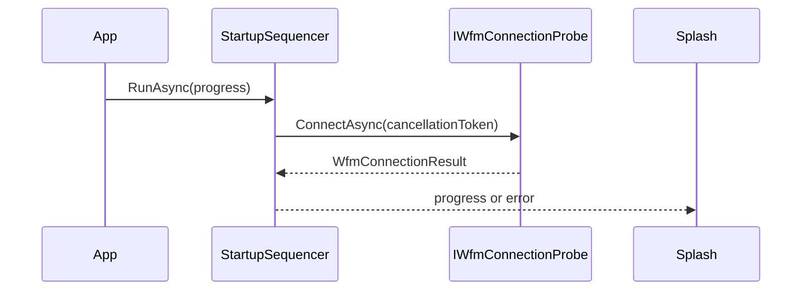
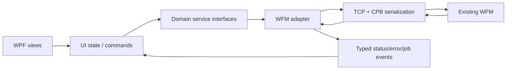

# WFM integration guide

## Status

WFM connectivity is not implemented in version 1.30.0. The application uses
sample jobs, sample errors, a local production timer, and a local machine-line
list. No code in this release may be treated as machine-control software.

The only current backend abstraction is `IWfmConnectionProbe`, used during the
splash sequence. `App` constructs `SimulatedWfmConnectionProbe`, and
`StartupSequencer` awaits it during the Connecting to WFM phase.

Replacing that probe alone would prove startup connectivity; it would not make
the rest of the application functional against a WFM.

## Current seam

The interface keeps TCP and serialization details out of the splash and
sequencer. Comments in the source identify the expected CPBObjectComGUI/TCP
area and base port 5150, but the final protocol, return channel, framing,
timeouts, reconnect policy, and object contracts must be confirmed from the
approved WFM specification.

## Proposed production-facing boundaries

The following interfaces do not exist yet. They are recommended seams to add
before wiring views to a backend:

| Proposed service | Replaces |
|---|---|
| `IWfmSession` | Startup-only probe; owns connect, disconnect, health, reconnect, and cancellation |
| `IJobService` | Seeded `JobRepository`; queries, loads, saves, removes, and reports current job |
| `IProductionControlService` | Dashboard timer and Start/Pause/Stop/Purge handlers |
| `IProductionStatusFeed` | Local counters, state, output rate, and simulated speeds |
| `IErrorFeed` | Hard-coded `ErrorsView` list and local clearing |
| `IMachineLineService` | Local module catalog and pending/confirmed line behavior |
| `ITechnicianAuthorizationService` | Non-empty code check |
| `ITechnicianSettingsService` | Local technician XML when settings become machine-owned |

Keep transport DTOs and serialized CPB objects inside an integration assembly.
Translate them into UI-neutral domain records before raising events to the WPF
layer.

## Recommended data flow

WPF controls should never open sockets, deserialize backend objects, or decide
protocol retry behavior. Backend callbacks must be marshalled onto the WPF
dispatcher before updating controls or observable UI state.

## Command requirements

Every machine-affecting command needs more than a button callback:

- explicit preconditions derived from authoritative machine state;
- a unique command or correlation identifier;
- acknowledgement versus completion semantics;
- timeout, retry, rejection, and disconnect behavior;
- idempotency rules, particularly for Start, Stop, and Purge;
- operator-visible progress and failure information;
- structured logging and audit requirements;
- cancellation and application-shutdown handling;
- safety ownership defined outside the GUI.

Do not optimistically change the UI to Running because a Start request was
sent. Display the state confirmed by the WFM/machine status feed.

## State migration order

An incremental integration can proceed in this order:

1. Confirm protocol and object contracts with the WFM owners.
2. Implement a connection/session adapter with a simulator and deterministic
   failure modes.
3. Extract the dashboard production state machine behind a service interface
   and automated tests.
4. Replace sample status and error feeds with read-only backend data.
5. Integrate job query/load while retaining local prototype creation only if
   explicitly required.
6. Integrate machine-line read and validation.
7. Add authenticated technician authorization.
8. Enable commands only after safety, fault, and acceptance requirements are
   approved and tested.

Read-only integration should precede machine-affecting commands.

## Compatibility and threading

- Keep the UI process responsive during connection and message processing.
- Use cancellation tokens for startup, shutdown, and reconnect work.
- Bound queues and define behavior for stale or out-of-order status messages.
- Version protocol DTOs independently from UI releases.
- Preserve canonical millimeter values at the domain boundary.
- Keep translated strings out of network messages and durable identifiers.

## Security and safety gate

The current technician dialog accepts any non-empty numeric code and retains no
identity. A production implementation needs an approved credential source,
attempt limits, session lifetime, audit events, secure handling, and explicit
authorization for individual operations.

The GUI must not replace PLC interlocks, guards, emergency stops, or safety
logic. Before any production connection, complete threat modeling, secure code
review, protocol testing, industrial hardware validation, failure-mode testing,
and C.P. Bourg acceptance.

## Integration acceptance evidence

At minimum, retain:

- protocol/version matrix and approved object definitions;
- simulator and real-system test results;
- connection loss/recovery and stale-state results;
- command acknowledgement/completion traces;
- authentication and authorization results;
- unit and localization boundary results;
- performance, soak, and resource measurements;
- safety and operational acceptance sign-off.
